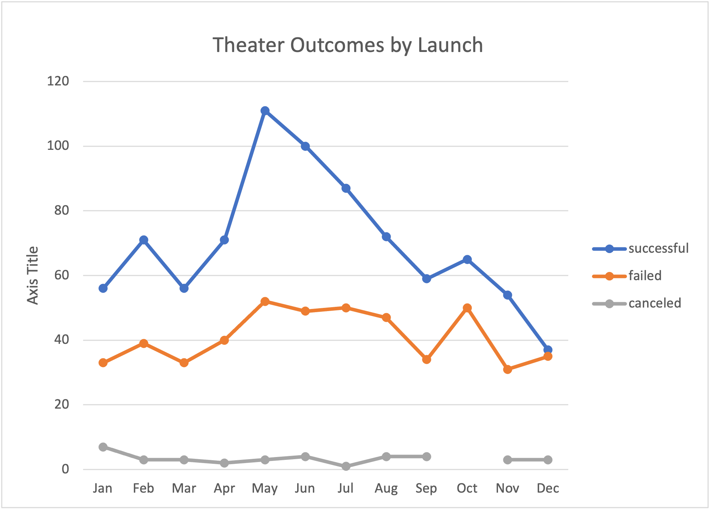
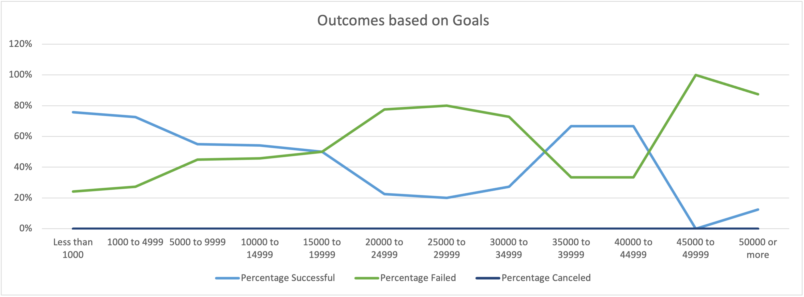

# Kickstarting Analysis to uncover trends based on Launch Date and Goals

## Overview of Project
This project is to create an analysis for a launch of a play for the client Louise. Based on Crowdfunding
data, We will be uncovering certain trends determine and predict outcomes for this launch. 

### Purpose
The purpose of this project is to determine what the most likely outcome of this play's release. We will analyze 
two data factors for the outcome.
	- Launch Date
	- Funding Goal

## Analysis and Challenges
Using Kickstarter data, we have created two analysis for our play's launch. Outcomes based on Launch date and Outcomes based on funding goals.
Here is a link to our final analysis
[Kickstater Challenge](./Kickstarter_Challenge.xlsx)

### Analysis of Outcomes Based on Launch Date
The pivot table along with a pivot chart are used to visualize the best time to
release our play.
The data displays successful, failed and canceled projects in the "Theater" category broken down by months of the year.
Here is a link to our Outcomes based on Launch Date analysis

### Analysis of Outcomes Based on Goals
The pivot table along with a pivot chart are used to visualize which funding goal levels were most successful.
The data displays percentage of successful, failed and canceled projects in the "Theater" category and the respective funding goal levels.
Here is a link to our Outcomes based on funding goals analysis

### Challenges and Difficulties Encountered
One of the challenges I encountered I faced was grouping the Dates columns in the Launch Date Outcomes pivot table

## Results

- What are two conclusions you can draw about the Outcomes based on Launch Date?
Two conclusions I can draw from the data is that 
	- most Theatrical release are released during the May/June time frame.
	- most successful releases are released during the May/June time frame

- What can you conclude about the Outcomes based on Goals?
	- a conclusion I can make about funding goals is that projects with goals of $1k or less are the most successful

- What are some limitations of this dataset?
	- a limitation I can think of is that doesn't provide type of play. (comedy, drama, satire, etc.)
- What are some other possible tables and/or graphs that we could create?
	- Outcomes based on Pledged amounts
	- Outcomes based on Country
	